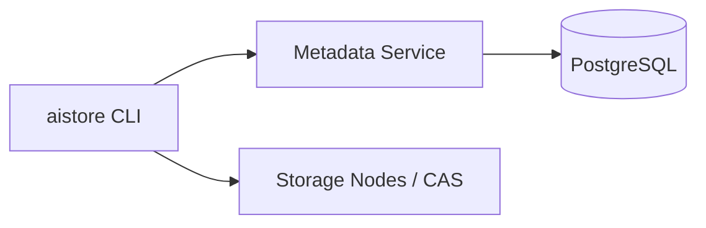

# AI Artifact Store

[](https://github.com/simonwen7/ai-artifact-store/actions/workflows/ci.yml)

AI Artifact Store is a C++20 systems project for content-addressed storage of large AI/ML artifacts: immutable versions, resumable Push/Pull, FastCDC chunking, multi-node replication, crash-safe GC, and AI-aware lifecycle policy — with PostgreSQL transactional metadata and Beast/Asio HTTP services.

Core system complete through **M10 portfolio/performance polish**. This is an engineering portfolio system, not a claim of production or enterprise readiness.

## Engineering Highlights

- Content-addressed CAS (chunk/object SHA-256 identity)
- Immutable Object / ObjectLayout / ArtifactVersion model
- One-pass resumable Push with RF placement
- Resumable verified Pull with atomic publish
- FixedSize + FastCDC chunking
- Multi-node Rendezvous placement and replica repair
- Read failover across registered storage nodes
- Crash-safe GC (physical-before-metadata)
- AI-aware lifecycle policy with terminal semantic retirement
- PostgreSQL transactional metadata control plane
- C++20 Boost.Beast / Boost.Asio networking

## Architecture



Full diagrams and flows: [`docs/architecture.md`](docs/architecture.md)

## Performance Snapshot

Reference **localhost Release** measurements (not a production SLA). Sources:

- [`benchmarks/results/m10_reference_chunking.json`](benchmarks/results/m10_reference_chunking.json)
- [`benchmarks/results/m10_reference_process.json`](benchmarks/results/m10_reference_process.json)

| Metric | Value |
| --- | ---: |
| FixedSize chunking+hash (128 MiB median) | 2533.5 MiB/s |
| FastCDC chunking+hash (128 MiB median) | 380.3 MiB/s |
| FixedSize shifted-content reuse ratio | 0.00 |
| FastCDC shifted-content reuse ratio | 0.958 |
| Cold RF1 Push (64 MiB) | 430.1 MiB/s |
| Warm dedup Push network avoidance | 1.00 (0 bytes sent) |
| Pull RF1 (64 MiB) | 208.8 MiB/s |
| RF2 storage-byte amplification | 2.0× |

Methodology, bounds, and deferred optimizations: [`docs/performance.md`](docs/performance.md)

## Quick Start

Prerequisites: CMake ≥ 3.25, C++20 toolchain, vcpkg, PostgreSQL, Ninja (optional).

```bash
cmake -S . -B build \
  -DCMAKE_BUILD_TYPE=Debug \
  -DCMAKE_TOOLCHAIN_FILE="$HOME/vcpkg/scripts/buildsystems/vcpkg.cmake"

cmake --build build -j
```

Apply migrations `001`–`011` to your database, then:

```bash
export AISTORE_DB_URL='postgresql:///your_db'
export AISTORE_STORAGE_ROOT=/tmp/aistore-cas
export AISTORE_STORAGE_NODE_ID=node-1
export AISTORE_STORAGE_PORT=8081

./build/metadata-service &
./build/storage-node &

./build/aistore node register \
  --storage-node-id node-1 \
  --storage-address 127.0.0.1 \
  --storage-port 8081

# Artifact rows must exist (no create-artifact CLI yet).
./build/aistore push --file ./artifact.bin --artifact-id <uuidv7>
./build/aistore pull --version-id <64hex> --output ./restored.bin
```

## Reliability / Failure Semantics

Persistent UploadSession / GcRun / ReplicationRun / LifecycleRun IDs, idempotent finalize, Pull partial resume, GC physical-before-metadata, and terminal lifecycle retirement.

Details: [`docs/failure-model.md`](docs/failure-model.md)

## Design Tradeoffs

Object identity independent of chunking, client-orchestrated data plane, Rendezvous placement, semantic retirement vs hard deletes, and measured-but-deferred HTTP/DB pooling in M10.

Details: [`docs/design-decisions.md`](docs/design-decisions.md)

## CLI

```bash
./build/aistore node register --storage-node-id node-1 --storage-address 127.0.0.1 --storage-port 8081
./build/aistore push --file ./artifact.bin --artifact-id <uuidv7> --replication-factor 2
./build/aistore pull --version-id <64hex> --output ./out.bin
./build/aistore repair --version-id <64hex> --replication-factor 2
./build/aistore gc --storage-node-id node-1
./build/aistore lifecycle run --policy-id <uuidv7>
```

Full flags/defaults: [`docs/cli.md`](docs/cli.md)

## Testing / Quality

- **415** correctness CTest cases (Debug)
- Six process E2Es: push, pull, FastCDC, GC, multi-node, lifecycle
- CI: explicit Debug test build + Release binary verification (benchmarks are not CI timing gates)
- Local Release build with `AISTORE_BUILD_BENCHMARKS=ON` for measurement tools
- clang-format / clang-tidy used in milestone closure

## Scope / Known Limits

Not in scope today: heartbeats/failure detectors, capacity-aware placement, background rebalance, HTTP keep-alive pools, PostgreSQL connection pools, Docker/Homebrew packaging, license selection.

Honest performance bottlenecks and architectural memory bounds are documented in [`docs/performance.md`](docs/performance.md).

## Technology

- C++20, CMake, GoogleTest
- PostgreSQL + libpqxx
- Boost.Asio / Boost.Beast / Boost.JSON
- OpenSSL
- vcpkg (`vcpkg.json`)
