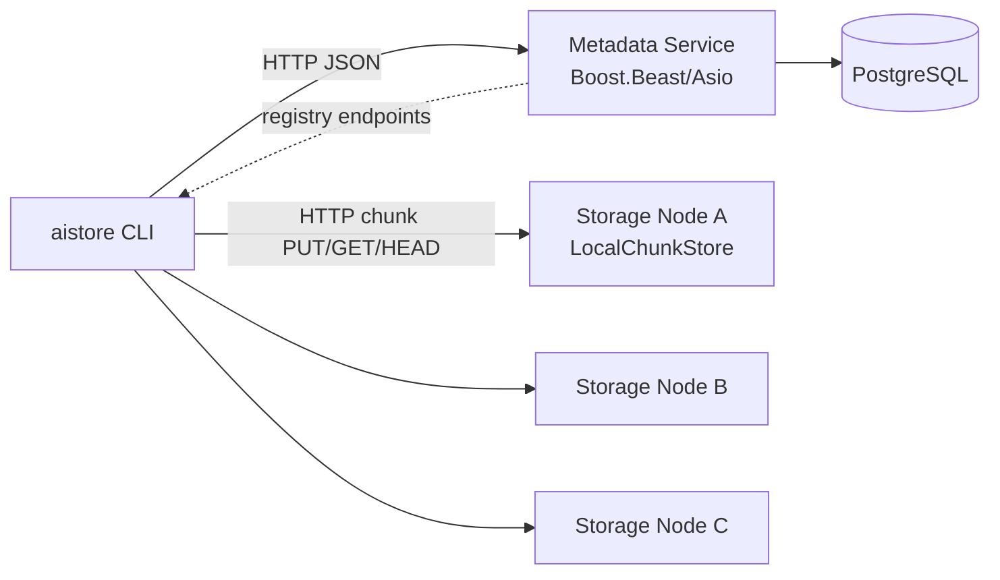
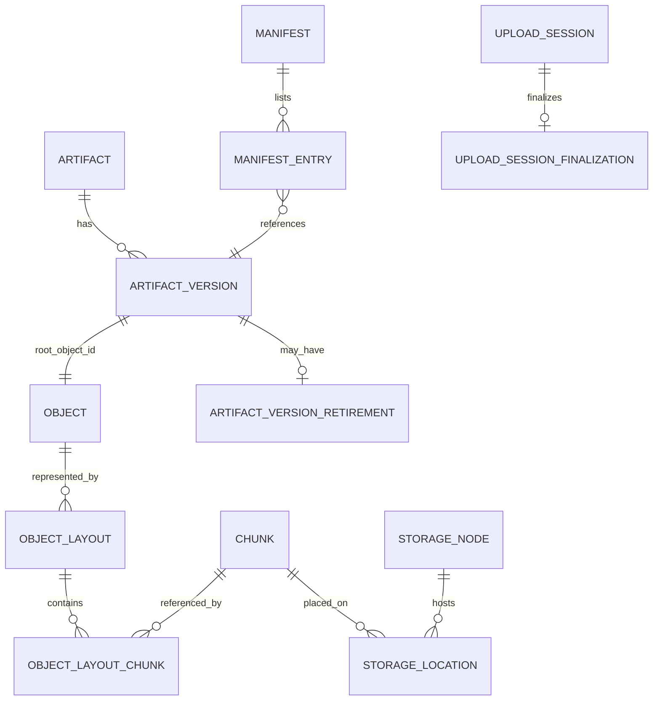
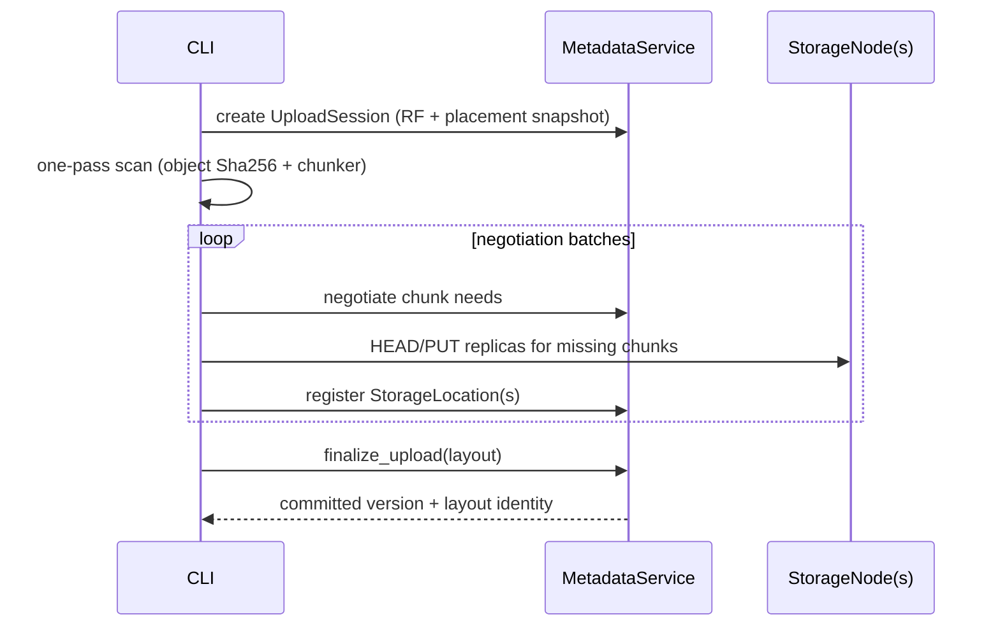
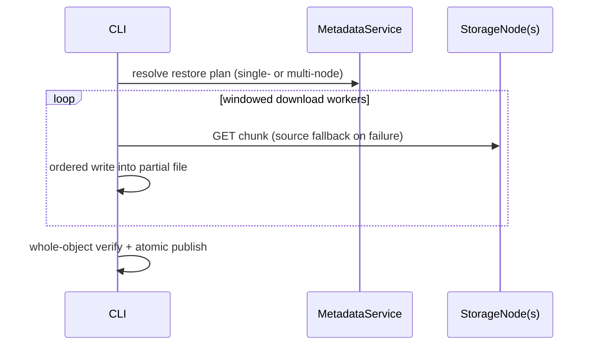
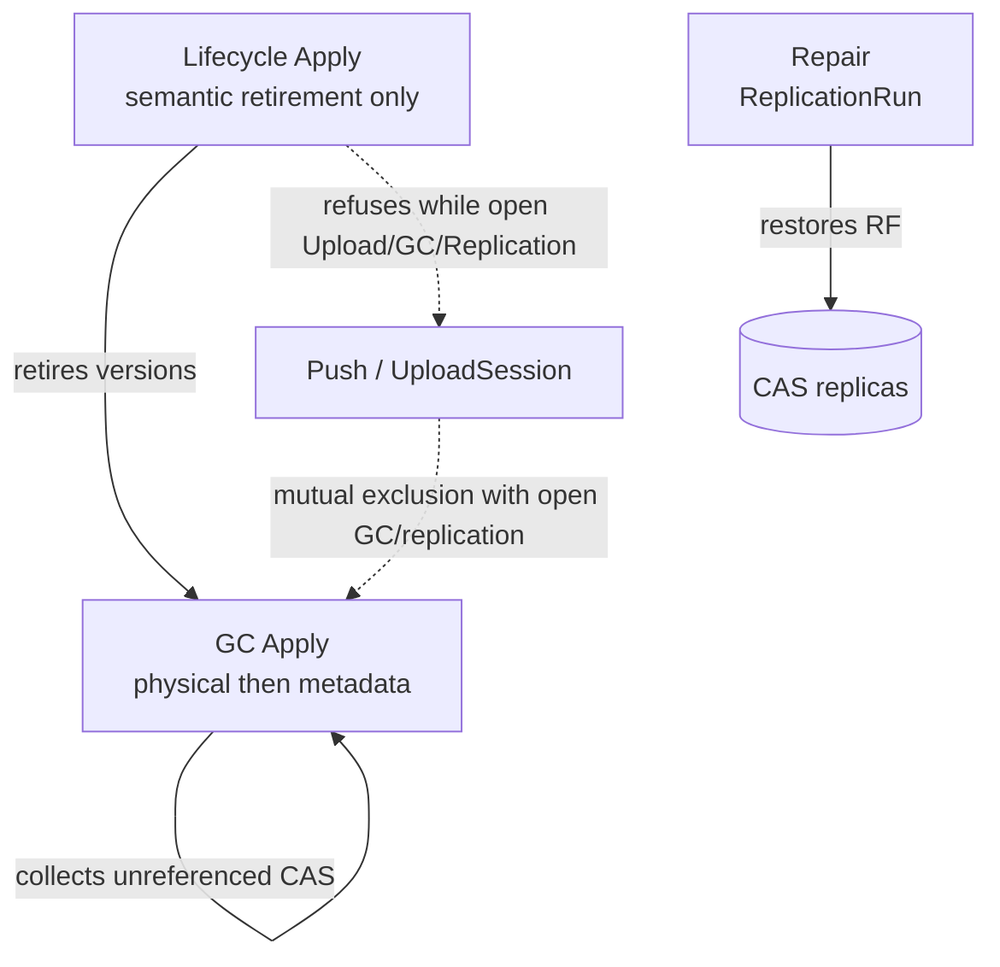

# Architecture

Factual current architecture of AI Artifact Store (through M10 polish). Details for CLI usage live in [`cli.md`](cli.md). Failure semantics: [`failure-model.md`](failure-model.md). Design tradeoffs: [`design-decisions.md`](design-decisions.md).

## High-level topology

## Identity / data model

Core identity rules:

- **Chunk ID** = SHA-256(chunk bytes)
- **Object ID** = SHA-256(entire raw object byte stream)
- **ObjectLayout ID** = SHA-256(canonical layout descriptor)
- **ArtifactVersion ID** = content-addressed version identity over immutable metadata + root object + parent

## Push flow

Push is client-orchestrated, one-pass over the source file, with outer worker concurrency and serial per-replica work inside each chunk task.

## Pull flow

## Repair / GC / Lifecycle relationship

- Lifecycle writes retirement records; it does not delete CAS bytes.
- GC deletes collectible physical chunks first, then sweeps metadata.
- Repair copies under-replicated chunks using planned sources/targets.

## Failure / transactional boundaries

| Boundary | Mechanism |
| --- | --- |
| UploadSession | Persistent Open/Committed/Aborted + finalization row |
| Finalize | Single PostgreSQL transaction committing version + layout + session state |
| Pull publish | Write partial → verify → hard-link/rename style atomic publish |
| ReplicationRun | Persistent Open/Completed with resume |
| GcRun | Persistent Open/Completed; physical-before-metadata |
| LifecycleRun | Metadata-only transaction; DryRun vs Apply |

See [`failure-model.md`](failure-model.md) for resume/ACK details.
